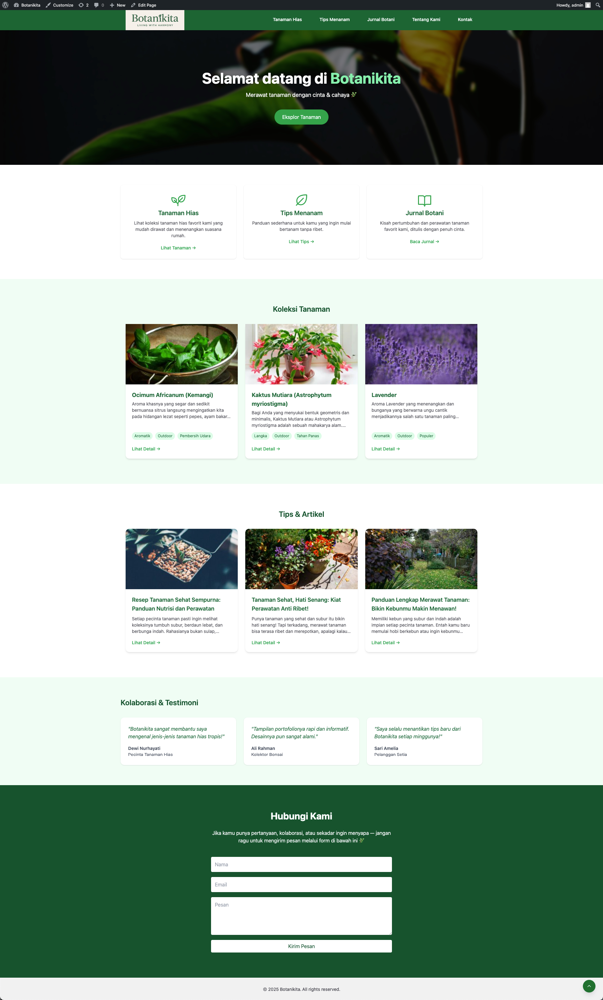
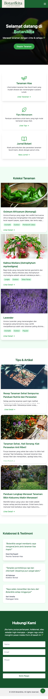
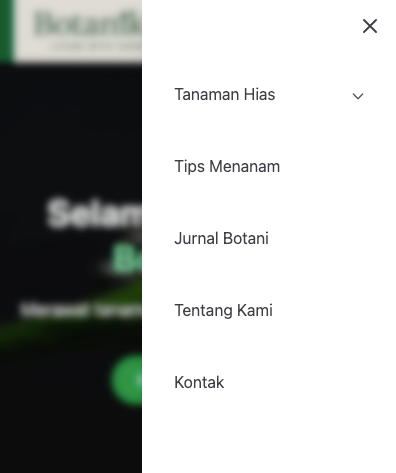
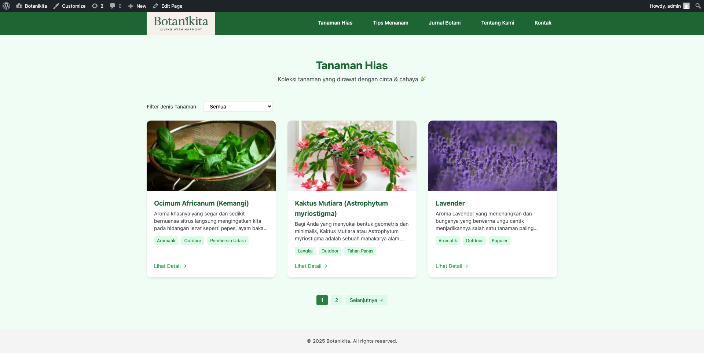
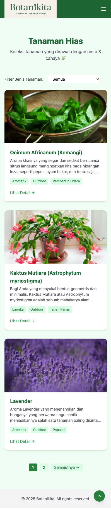
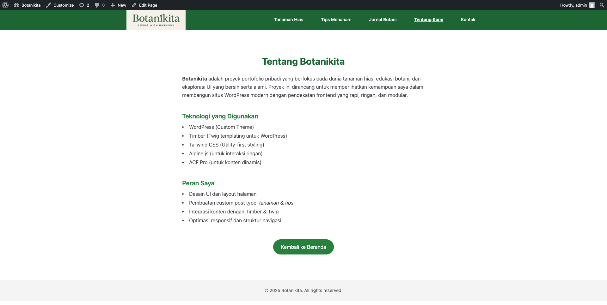
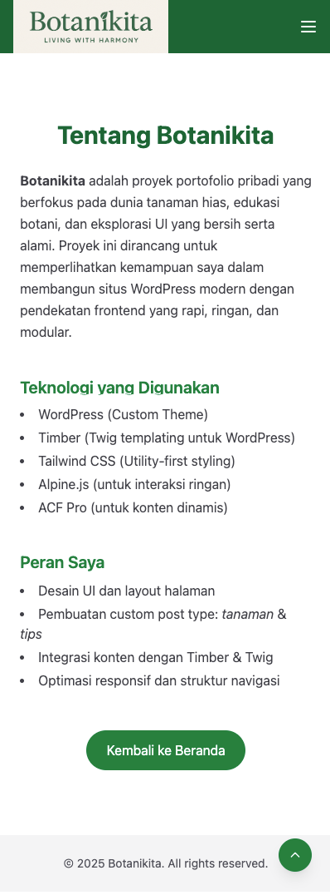
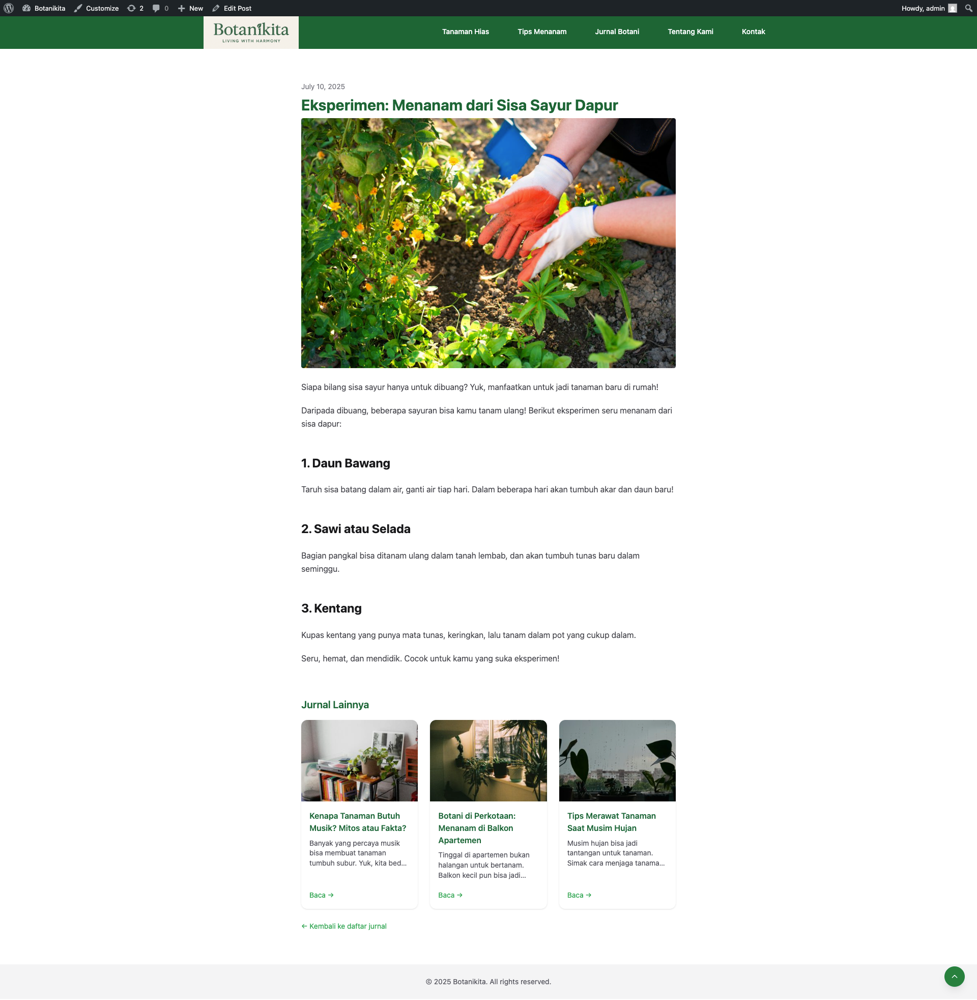

# 🌿 Botanikita — WordPress Portfolio Project

**Botanikita** is a personal project centered around ornamental plants, developed as a portfolio showcase for frontend development using WordPress.  
The main goal is to explore modern theme architecture using Timber (Twig templating), Tailwind CSS, and Alpine.js.

---

## 🔧 Tech Stack

| Technology     | Description |
|----------------|-------------|
| **WordPress**  | Main CMS for content management |
| **Timber**     | Twig-based templating for cleaner, modular themes |
| **Tailwind CSS** | Utility-first CSS framework for responsive layouts |
| **Alpine.js**  | Lightweight JavaScript for frontend interactivity |
| **ACF Pro**    | (Optional) Custom fields for post types |

---

## 📌 Key Features

- **Custom Homepage**: Hero section, 3 categories, plant collection, tips & articles
- **Custom Post Types: Plants & Tips**: Includes `archive` and `single` templates
- **About & Contact Pages**: Styled consistently with working contact form (Formspree)
- **AJAX Contact Form**: Real-time feedback without page reload
- **OG Image & SEO Tags**: Dynamic meta tags with `default-og.jpg` fallback
- **Scroll to Top Button**: Smooth UX with floating button (SVG + Alpine)
- **Responsive Design**: Optimized for both desktop and mobile

---

## 📁 Template Structure

```
/wp-content/themes/botanikita/
├── templates/
│   ├── front-page.twig
│   ├── archive-tanaman.twig
│   ├── single-tanaman.twig
│   ├── archive-tips.twig
│   ├── single-tips.twig
│   ├── page-about.twig
│   ├── page-kontak.twig
│   ├── partial/
│   │   └── _testimonials.twig
│   └── base.twig
├── assets/
│   ├── default-og.jpg
```

---

## 💡 Project Goals

This project was created to:

- Showcase the ability to build custom WordPress themes
- Maintain clean and well-structured code
- Apply natural, minimal UI principles
- Serve as a professional portfolio piece for LinkedIn, CVs, and GitHub

---

## 👋 About Me

I'm a frontend-focused developer who loves crafting modern websites using technologies like WordPress, Tailwind, Alpine, and JavaScript frameworks. I enjoy building modular, scalable, and maintainable interfaces.
I believe in clean visuals, lightweight performance, and creating natural, immersive web experiences.

---

## 📷 Preview

  
  
  
  
  





---

## 📩 Contact

If you're interested in this project or would like to collaborate:
- Email: ragum.zy@gmail.com
- LinkedIn: https://www.linkedin.com/in/abdurrahman-ragum-zuhair-yazid-a58b05112/
